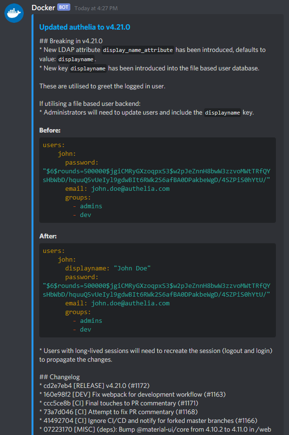

# updateContainers
Bash script to update docker containers and send release notes to Discord

Features:
- Use docker-compose to update your provided list of containers.
- Send Discord embed messages with release note information.
- Hyperlink to updated version on Github.
- Keep track of container versioning.
- Option to only track release notes (no container updates).

Example:

Notes:
- Discord has a 2000 character limit, as such any release notes greater than the limit will be trimmed.
- Not all repositories follow the standard release template, so sometimes this may not work as intended.
- Github has a standard 60 api calls per hour limit, make a personal access token through developer settings and place it in the script 'githubToken' variable. Now you are able to access the api up to 6000 times per hour which is more than enough for this. 

